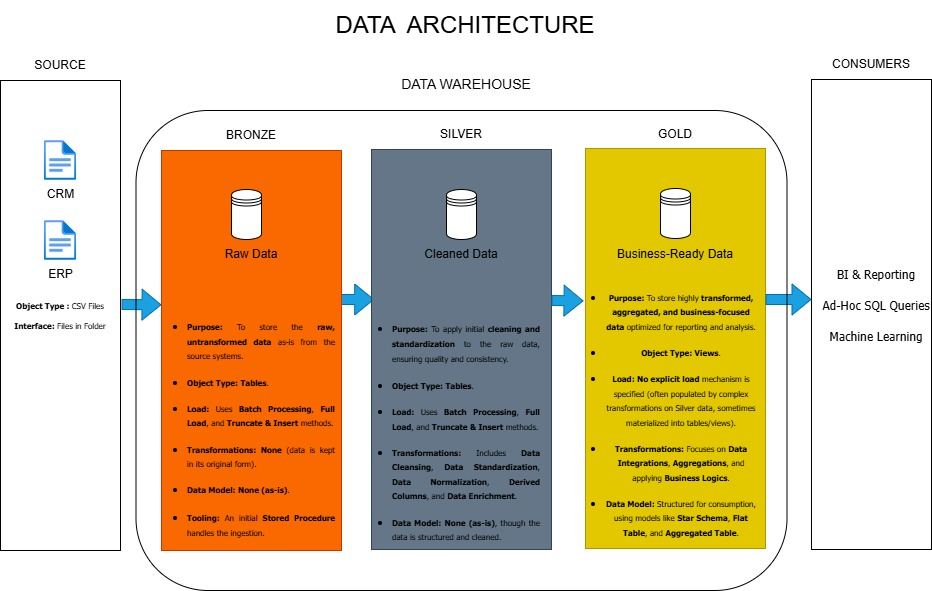

# 🌍 Data Warehouse and Analytics Project

Welcome to the **Data Warehouse and Analytics Project** repository! 🚀  
This project, developed by **Osazuwa Micheal Kelvin**, demonstrates a complete **data warehousing and analytics pipeline** — from raw data ingestion to business-ready insights.  
It follows the **Medallion Architecture (Bronze → Silver → Gold)** and showcases best practices in **data engineering**, **data modeling**, and **analytical SQL development** using **PostgreSQL**.

---

## 🏗️ Data Architecture

The project is structured using the **Medallion Architecture** pattern for scalability, reliability, and clarity.



### 🔸 Bronze Layer
Stores **raw data** ingested from ERP and CRM systems (CSV files).  
This layer preserves original data for traceability and auditability.

### 🔸 Silver Layer
Performs **data transformation, standardization, and cleansing**.  
Ensures accuracy, completeness, and consistency of data before it’s loaded into analytics models.

### 🔸 Gold Layer
Houses **business-ready data models** — fact and dimension tables — optimized for analytics and reporting.

---

## 📖 Project Overview

This repository demonstrates the **end-to-end data warehouse lifecycle**, including:

1. **Data Architecture** – Designing a Medallion-based PostgreSQL data warehouse.  
2. **ETL Development** – Extracting, transforming, and loading data using SQL scripts.  
3. **Data Modeling** – Creating star schema models for efficient analysis.  
4. **Analytics** – Writing analytical queries for business insights.

**Core Competencies:**
- Data Engineering & ETL Development  
- SQL Optimization & Data Modeling  
- Data Quality Management  
- Analytical Reporting & Visualization

---

## 🛠️ Tools & Resources

All resources and technologies used in this project are free and open-source.

| Tool | Purpose |
|------|----------|
| **PostgreSQL** | Database engine for storage, transformation, and querying. |
| **pgAdmin 4** | GUI for managing PostgreSQL databases and executing SQL scripts. |
| **GitHub** | Version control and collaboration platform. |
| **Draw.io** | Design of data architecture diagrams and schema visualizations. |
| **Notion** | Project task management and documentation organization. |

---

## 🚀 Project Requirements

### 🧩 Data Warehouse (Engineering Phase)

**Objective:**  
Design and implement a **PostgreSQL-based data warehouse** that integrates CRM and ERP data into a unified analytical model.

**Specifications:**
- **Data Sources:** ERP and CRM CSV datasets.  
- **Data Quality:** Validate and clean before transformation.  
- **Integration:** Merge both sources into unified entities.  
- **Scope:** Latest dataset only (non-historical).  
- **Documentation:** Full schema, metadata, and lineage provided.

---

### 📊 Analytics & Reporting (Analysis Phase)

**Objective:**  
Deliver meaningful business insights through analytical queries on the **Gold Layer**.

**Focus Areas:**
- Customer Demographics & Segmentation  
- Product Performance  
- Sales Trends & Profitability

---

## 📂 Repository Structure

```plaintext
data-warehouse-project/
│
├── datasets/                           # Raw ERP & CRM CSV files
│
├── docs/                               # Documentation & diagrams
│   ├── etl.drawio                      # ETL process flow
│   ├── data_architecture.drawio        # Architecture diagram
│   ├── data_catalog.md                 # Dataset descriptions
│   ├── data_flow.drawio                # Data movement flow
│   ├── Entity Relation Diagram.drawio  # Star schema model
│   ├── naming-conventions.md           # Naming standards
│
├── scripts/                            # SQL scripts for all layers
│   ├── bronze/                         # Extract & load raw data
│   ├── silver/                         # Clean & transform data
│   ├── gold/                           # Create fact & dimension tables
│
├── tests/                              # Quality validation queries
│
├── README.md                           # Main documentation (this file)
├── LICENSE                             # Project license
├── .gitignore                          # Git ignore rules
└── requirements.txt                    # Environment/tool dependencies

## 🛡️ License

This project is licensed under the [MIT License](LICENSE).  
You are free to use, modify, and share this project with proper attribution.

> **Acknowledgment:**  
> This work was **modified and extended by Osazuwa Micheal Kelvin**, based on the original work by **Baraa Khatib Salkini (Data With Baraa)**.
